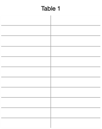

# This respository contains scripts on univariate time-series prediction

Once data is available in datetime & dependent column, this script can be used to auto train as well as auto select the best algorithm for time based predictions.

**Sample Data**

Necessary Data Preprocessing Steps - 

- first column should be date and second column should be dependent column
- dependent column should be of numeric datatype
- current month datapoint should be removed
- data should be aggregated to monthly level without date part
- date column shouldn't be set as index, defined function handles that

There are two functions - 

- train_predict - use this in case of only two columns - date & dependent
- train_predict_centre - use this if prediction is needed basis location or centre

Both the functions return -

- performance - RMSE & MAPE of the fit
- predictions - half year prediction including current month